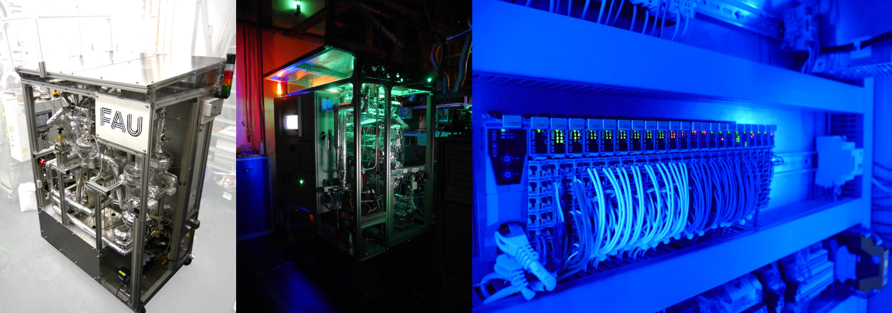
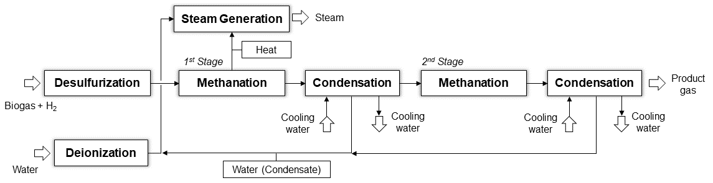
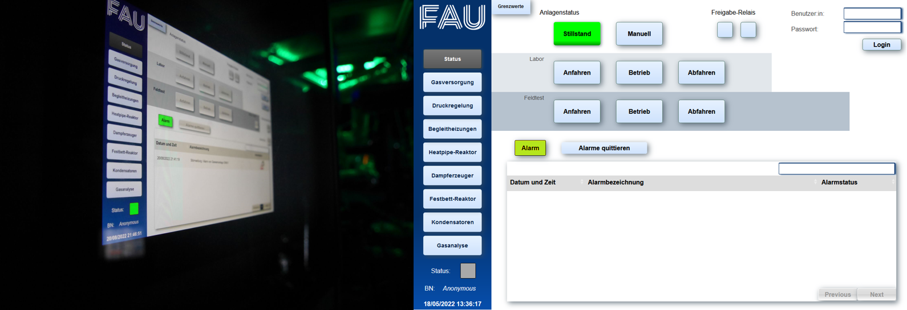

# PLC_Meth

The **PLC_Meth** project provides the source code for full automation of a two-stage chemical methanation plant (Fig. 1). The pilot plant was designed and built at the Institute of energy process engineering at the Friedrich-Alexander-Universität Erlangen-Nürnberg (FAU). It has been designed for investigating the methane production from hydrogen and biogenic gases in industrial environments and features a programmable logic controller from B&R Industrial Automation GmbH.

Long-term tests at an industrial biomethane production plant in the *Power-to-Biogas* project (Project ID: 03KB165) for a over a year and at a waste water treatment plant in the *Kläffizient* project (Project ID: 03EI5421) for several months has proven the reliability of the software and hardware architecture for operating the plant [1]. 

In addition, **PLC_Meth** includes routines for fully automated operation of the plant with startup, load changes, and cooldown on the basis of *rule-based control* for *dynamic optimization* and *Supervised Learning* methods for temperature control. This has further been used for *dynamic real-time optimization* and autonomous operation of the plant by using *deep Reinforcement Learning*. For more information, please refer to [2].



*Figure 1: Two-stage methanation plant with control cabinet including an industrial PLC and I/O block.*

---

## Table of Contents

1. [Overview](#overview)
2. [Project structure](#project-structure)
3. [Installation and Usage](#installation-and-usage)
4. [License](#license)
5. [Citing](#citing)
6. [References](#references)
7. [Acknowledgments](#acknowledgments)

---

## Overview

**PLC_Meth** provides the main programming scripts of the software backend for automation of the methanation plant. The following subsections describe the process and the control architecture in more detail.

### Chemical methanation plant

Methanation defines the conversion of hydrogen (H<sub>2</sub>) and carbon monoxide (CO) or carbon dioxide (CO<sub>2</sub>) into methane (CH<sub>4</sub>). They are typically catalyzed to facilitate the underlying reactions. In chemical methanation, the reactors apply chemical catalysts, such as Nickel (Ni), to perform the reaction and typically operate at temperatures and pressures in a range of 473–823 K (200-600 °C) and 0.1-10 MPa (1-100 bar) [3,4]. The following equations delineate the reactions where water (H<sub>2</sub>O) also arises as a byproduct:

CO<sub>2</sub> + 3 H<sub>2</sub> <-> CH<sub>4</sub> + 2 H<sub>2</sub>O

CO + 3 H<sub>2</sub> <-> CH<sub>4</sub> + H<sub>2</sub>O

Both reaction pathways from CO and CO<sub>2</sub> are highly exothermic, i.e., produce considerable reaction heat. To maintain the material limits and avoid overtemperatures, the reactors are cooled and the waste heat is used to produce steam. Figure 2 portrays the block diagram of the methanation plant.



*Figure 2: Block diagram of the two-stage methanation plant with steam generation, intermediate water removal, condensation, and water supply (according to ISO 10628).*

The two-stage methanation plant contains the following units for methane production:
 - **1<sup>st</sup> methanation stagewith steam generation**: The first methanation stage is a fixed bed reactor filled with Ni catalyst particles. It converts the preponderance of H<sub>2</sub> and CO(<sub>2</sub>) into CH<sub>4</sub> and thus produces the majority of heat. For this reason, the reactor is actively and directly cooled (polytropic) by special cooling devices, so-called heatpipes. These heatpipes transport the reaction heat from the fixed bed to a steam generator which uses the heat to evaporate water and produces steam. The temperatures in the reactor are controlled by adjusting the water flow to the steam generator. While a high water flow increases reactor cooling and, hence, decreases reaction temperature, a low water flow decreases reactor cooling.
 - **2<sup>nd</sup> methanation stage**: The second methanation stage further promotes methanation of H2 and CO(2) and upgrades the gas quality to the requirements of gas grid injection, i.e., product gas CH4 concentration > 95 %. Since the conversion and heat release is less than the first stage, it does not feature a heatpipe cooling system. To maintain the temperatures below the material limits, it alternatively uses two different approaches for reactor cooling. On the one hand, the second stage allows heat transfer through the walls which reduces the temperatures in the outer bed regions. On the other hand, the water content in the inlet stream is controlled by the intermediate condenser to adjust the conversion rates in the second stage. High concentration of water (byproduct) shift the chemical equilibrium to the reactant side and thus decrease conversion and heat release. 
 - **Condenser for intermediate water removal**: The condenser for intermediate water removal is a shell and tube heat exchanger. By adjusting the cooling water flow into the condenser, it controls the gas temperature and the partial condensation of water. As a result, the condenser can control the water content of the feed gas in the downstream second methanation stage for temperature control.
 - **Condenser for product gas cooling**: The condenser for product gas cooling has also been designed as shell and tube heat exchanger. It cools and dries the product gas of the methanation plant.
 - **Gas control**: The methanation plant comprises a gas control system composed of two mass flow controllers (MFC). Due to the fact that the plant has been used for direct methanation of biogas (up to 55% CO<sub>2</sub>) in the *Power-to-Biogas* and *Kläffizient* project, the gas control features one MFC for hydrogen and one for biogas.
 - **Water supply**: The water supply ensures the deionization of tap water for steam generation and condenser cooling. It includes a storage tank and two pumps. The diaphragm pump transports water doses water from the storage tank to the steam generator, while the second pump can be used for storage tank emptying.
 - **Sensors and actuators**: The methanation plant contains numerous sensors for temperature, pressure, gas concentrations, and water levels, in total 98 sensors. Additionally, it includes 49 valves for gas and water control and 11 elements for electric trace heating of the single components. The electric trace heating is necessary for reactor heating during plant startup and to avoid freezing of water at ambient temperatures below the freezing point.

### Programmable logic controller 

**PLC_Meth** contains several different programming scripts developed with *Structured Text*, a programming language for PLC defined by PLCOpen in IEC 61131-3. The scripts are running in high frequency (0.001 - 0.1 seconds) in the PLC. Note that the source code only provides the software code for processing and automation of the plant including definition of global types, variables, and error messages, but it neglects the part which assigns the variables to the hardware I/O block of the PLC, since this might be specific for a single plant.

The code contains 11 programming scripts:
| Script | Description |  
|-----------|------------|  
| **Condenser_Control** | Controls the cooling water flow, the water level, and condensate removal. |  
| **Data_Processing** | Converts the analog and digital signals from the I/O hardware block into values suitable for computations within the scripts and vice versa.|  
| **Gas_Analysis** | Controls the gas measurments since the plant allows to measure only one gas stream (reactant gas, gas after first stage, product gas) at a time. |  
| **Gas_Control** | Controls feed gas flow rates in the MFCs. | 
| **Pressure_Control** | Controls operating pressure of the plant. | 
| **Safety_Mechanisms** | Defines the safety mechanism to ensure stable and safe operation of the plant with temperatures and pressure within the limits. | 
| **Steam_Generator** | Controls the diaphragm pump for water supply to the steam generator and cooling of the first methanation stage. |
| **System_Status** | Defines the plant status, i.e., idle state, startup in the lab/ field, operation in the lab/field, cooldown in the lab/field, error state, hot standby, and manual operation. | 
| **Temperature_Control** | Controls the electric trace heating elements for heating the reactors and peripherie. | 
| **Visualization** | Contains data conversion for visualization of temperature profiles in the human machine interface (HMI). |
| **Water_Supply** | Controls the valves for water supply and water level regulation in the condensate traps. |

Note that most of the control methods for set point tracking of values (*regulatory control*) use proportional-integral-derivative controllers (PID), which have been to tuned manually to good control performance in the plant. 

For full autonmation of the plant, **PLC_Meth** moreover uses *rule-based control* for *dynamic optimization* of startup, load changes, and cooldown. This *rule-based control* decides on different actions depend on the maximum catalyst temperature in the first methanation stage. This quantity is key for overall control of the plant because it indicates the progress of reactor heating during startup, the changes of the temperature profile during load changes, and the progress of reactor cooling during cooldown.

For temperature control in the reactors, the plant controls the heatpipe cooling in the first methanation stage and the water content in the second methanation stage. The temperature thresholds are hereby defined by two catalyst deactivation phenomena present in direct methanation of biogas. The first deactivation mechanism which appears at temperatures > 883 K is sintering, which signifies the thermally induced alteration and the loss of catalytic surface area. On the other hand, the direct methanation of biogas is prone to carbon formation, the second deactivation mechanism. 

Carbon formation strongly depends on the gas composition and temperatures. However, as soon as the temperature is below the *critical temperature for carbon formation* (T_crit) [5]. T_crit can be derived from chemical equilibrium data at distinct gas compositions and pressure. **PLC_Meth** incorporates an empirical equation based on large equilibium data and *linear regression with non-linear basis functions* (*Supervised Learning*). 

The human machine interface comprises a panel surface at the front of the control cabinet, which can also be accessed by a web browser. The corresponding visualization with pages for the different control parts has been modelled using *mapp View*.



*Figure 3: Human machine interface of the methanation plant.*

The alarm system of the plant has moreover been implemented based on the warning and error signals delivered by the `Safety_Mechanisms` script and *mapp AlarmX*. 

---

## Project Structure

The project is organized into the following directories and files:

```plaintext
PLC_Meth/
│
├── img/
│
└── src/
    ├── Condenser_Control/
    ├── Data_Processing/
    ├── Gas_Analysis/
    ├── Gas_Control/
    ├── Pressure_Control/
    ├── Safety_Mechanisms/
    ├── Steam_Generator/
    ├── System_Status/
    ├── Temperature_Control/
    ├── Visualization/
    ├── Water_Supply/
    ├── Global.typ
    ├── Global.var
    └── LocalizableTexts.tmx

```

Every folder in `src/` is ascribed to one programming script and includes a main script `main.ab` and files for declaration of local types `Types.typ` and variables `Variables.var`.
In addition, `src/` contains also two files for global types `Global.typ` and variables `Global.var`. The `.var` files not only feature variables of the process, but also constants and special *function modules* (`FB`) loaded from external libraries. To keep the code consistent and easy to understand, the notation follows the following syntax, while variables are defined in lower case letters and constants in capital letters:

`<global/local>_<type>_<description>` 

| Syntax | Description |  
|-----------|------------|  
| `global/local` | Global and local variables/constants feature a `g`/`G` and a `l`/`L` as first letter, respectively. |  
| `type` | The variable/constant types are declared by `b`/`B` (boolean), `i`/`I` (integer), and `r`/`R` (real), or by special types defined in `Global.typ`.|  
| `description` | Every variable/constant features a short descriptions or abbreviation for identification.| 


---

## Installation and Usage

Follow these steps to install and run the project:

```bash
# Clone the repository
git clone https://github.com/SimMarkt/PLC_Meth.git

# Navigate to the project directory
cd PLC_Meth


```

Copy and paste the source code to the folder of your PLC software project and adjust the variables in the physical IO settings

## License

This project is licensed under [MIT License](LICENSE).

---

## Citing

If you use PLC_Meth in your research or application, please cite it using the following BibTeX entry:
```BibTeX
@misc{PLC_Meth,
  author = {Markthaler, Simon},
  title = {PLC_Meth: Programmable logic controller for chemical methanation},
  year = {2024},
  url = {https://github.com/SimMarkt/PLC_Meth}
}
```

---

## References

[1] S. Markthaler, "*Katalytische Direktmethanisierung von Biogas: Demonstration
in industrieller Umgebung und Betriebsoptimierung mittels Reinforcement
Learning*", DECHEMA Jahrestreffen der Fachsektion Energie, Chemie
und Klima (11.-12.03.), Frankfurt/Main, 2024

[2] S. Markthaler, "*Optimization of Power-to-Gas operation and dispatch using Deep Reinforcement Learning*", Dissertation (PhD Thesis), Friedrich-Alexander-Universität Erlangen-Nürnberg, 2025 (not yet been published).

[3] S. Rönsch, J. Schneider, S. Matthischke, M. Schlüter, M. Götz, J. Lefebvre, P. Prabhakaran, S. Bajohr, "*Review on methanation – From fundamentals to current projects*", Fuel, 166, 2016, 276–296.

[4] M. Götz, J. Lefebvre, F. Mörs, A. McDaniel Koch, F. Graf, S. Bajohr, R. Reimert, T. Kolb, "*Renewable Power-to-Gas: A technological and economic review*", Renewable Energy, 85, 2016, 1371–1390

[5] S. Markthaler, F. Grimm, J. Karl, “Direct catalytic methanation of Biogas (DMB):
From laboratory experiments to demonstration scale”, 4th Doctoral Colloquium
BIOENERGY (13.-14.09.), Karlsruhe, 2021


---

## Acknowledgments

This project was funded by the German *Federal Ministry for Economic Affairs and Climate Action* within the **Power-to-Biogas**
project (Project ID: 03KB165). 

---